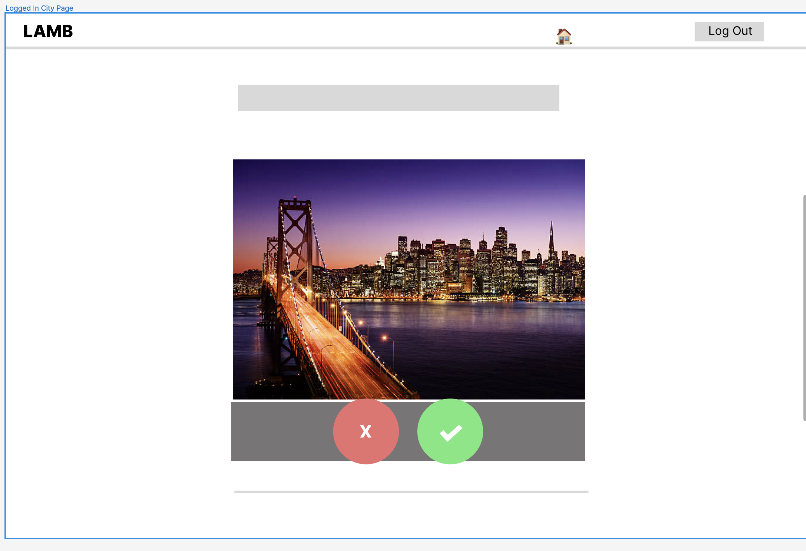

# Project Plan

Pod Members: **Habeebah Muse, Lucia Barboza, Angelica Ramirez**

## Problem Statement and Description

The problem that our capstone pod would like to solve are the issues that come with relocating to a different place (city/state). People relocating lack the experience and the familiarity of the city or area to choose housing that is safe and aligns with their hobbies, values, and lifestyle. They lack knowledge or awareness and the sense of the area like the accessibility or comfort with their liking. People looking for permanent location.

## User Roles and Personas

Include the most up-to-date user roles and personas.
User Persona
1
Rebecca Smith is from Dallas, Texas. Her hobbies include horseback riding, reading a book, and lots of coding. Rebecca also attends the University of Texas and is a computer science student. Rebecca is a first generation student and has big dreams of working in a big city. She's an introvert.

She is 20 years of age and she is an aspiring software engineering intern. She uses all types of tech devices such as her laptop, phone, etc. She might access the site whenever she is in the relocation process.

Rebecca’s motivation for using the app is that she wants to find a safe and comfortable place so that her family knows she is not in danger.

Potential pain points for Rebecca would be a slow web app, a not-so appealing interface, not having the implementation of the crime rate in the web app, an unorganized website rather than an all-in-one component web app.

2
Tom is a 25 year old college graduate who is working in his father’s company as a traveling consultant. Tom is from New York City and is excited to go on his first trip to Washington for business. Tom is a gym rat and is worried there won’t be any gyms near his housing.

He is not tech savvy. He does know how to use his phone well. He uses his laptop more to make Excel sheets. This means that the web app has to be really user friendly especially with the interface. Tom will have to use the web app a lot because he travels to different places almost twice a week.

Tom’s motivation for using the app is moving to another state for his father’s business. He wants to find safe housing and also weight-lifting gyms near the area.

Some potential pain points for Tom are if the web app is not a mobile app and if the interface isn’t easy to navigate.

## User Stories

1. As a registered user, I want to be able to find other people moving to the same general location I am moving to. I want a list generated of people moving to my new location.
2. As a registered user, I want to be able to search cities based on my interests. I want that when I put in my preferences, I see a list of city that match that preference.
3. As an unregistered user, I want to be able to read more information about what the website does. I want to be able to read more information about what the web application does before I create an account or sign in.
4. As an unregistered user, I like to be able to sign in and login to the website.
5. As a registered user who loves going to the gym, I want to see cities that contain a variety of gyms.
6. As a registered user who lives in the United States, I want to see cities from the United States.
7. As a registered user who doesn’t have a car, I want to see cities that have active public transportation.
8. As an unregistered user who doesn’t know the app, I want to be able to view the registration page with information about the app.
9. As a registered user who works in tech, I want to see cities that have my job in demand.
10. As a registered user who is a college student and mom at the same time, I want to be able to see the crime rates in the cities I am researching.
11. As an unregistered user, I want to be able to search the cities I am desiring in the search bar.
12. As an unregistered user, I want to be able to see the city card after searching up my city of interest. I should have a sneak peek description of info of city, but I would have to register to see the full thing.
13. As a registered user, I want to be able to click on a house (shopping-cart) to see the list of matches I accepted or saved.
14. As a newly registered user, I want to be able to register and choose my preferences (user input) to get matched. This only happens once, because I do not want to login again and see the preference (user input) page.
15. As a registered user who is logging in again, I want to be able to see a settings page that can allow me to update my preferences again.
16. As a registered user, I want to be able to access the matched cities list and have the option to remove the matched cities list items.

## Pages/Screens

List all the pages and screens in the app. Include wireframes for at least 3 of them.

- Registration Page
- Login Page
- Unregistered Page
- More Information Page 
- The matched cities list page 
- The user preferences after new user's page 
- The about us page

## Data Model

User’s table: contains the user’s personal information. This allows us to keep track of the user’s data (one to many relationships) to ensure the correct user is find their data.

| User Type  |  Type   |            Description |
| :--------- | :-----: | ---------------------: |
| id         | integer |              unique id |
| fName      |  text   |      user’s first name |
| lName      |  text   |       user’s last name |
| username   |  text   |        user’s username |
| password   |  text   |        user's password |
| created_at | integer | time it was created at |
| email      |  text   |    user's email unique |

User Preferences Table : The user’s preferences based on the provided topics. This will allow us to provide a more personalized approach to their city feed.
|User Preferences|Type|Description|
| :---------------- | :------: | ----: |
|id |integer |unique id for the user preferece
|hobbies |text |displays the hobby of the user
|state| text |displays the state the user wants to go to
|weather| text |Dispays the weater of the user's preffered state
|industry |text |Displays the industry the user may be working in

City Table: the state the city is in, the temperatures (weather), the activities known in that city, the crime rate in that city, and if the city is family friendly.

| CityInfo        |    Type    |                                  Description |
| :-------------- | :--------: | -------------------------------------------: |
| state name      |    text    |                    Description of that state |
| city            |    text    |                                     The city |
| highest temp    |    text    | The highest temperature in the specific city |
| lowest temp     |    text    |  the lowest temperature in the specific city |
| average temp    |    text    | The average temperature in the specific city |
| activity        |   string   |                               Common activiy |
| crime rate      |  integer   |            the crime rate known in that city |
| family-friendly |  boolean   |                 is the city family friendly? |
| img_url         | text image |                             URL for the city |

State Table: name of the table and the description.

| State      | Type |               Desciption |
| :--------- | :--: | -----------------------: |
| state_name | text | description of the state |

## Endpoints

| HTTP   |                                                      Description                                                       | UserStories(id) |
| :----- | :--------------------------------------------------------------------------------------------------------------------: | --------------: |
| GET    |                            gets user login credentials to authenticate user to the website                             |               5 |
| POST   |                            gets user register information to get the new user authenticated                            |               5 |
| POST   |                                  Let user input state they desire, job title, weather                                  |               3 |
| GET    |                                  let unregistered user search city of their interest                                   |              12 |
| GET    |                           let unregistered user see city card sneak peek but no description                            |              13 |
| GET    |                      let registered user see city matched card with entire city info/description                       |         7, 8, 9 |
| GET    |                          let registered user click shopping cart house to see list of matches                          |              13 |
| PUT    |        as a registered user, I want to change my pereferences via the settings page, not see the new user page         |              15 |
| DELETE | as a registered user, I want to be able to navigate to the housing shopping cart and delete a previously matched city. |              16 |

**_Don't forget to set up your Issues, Milestones, and Project Board!_**
